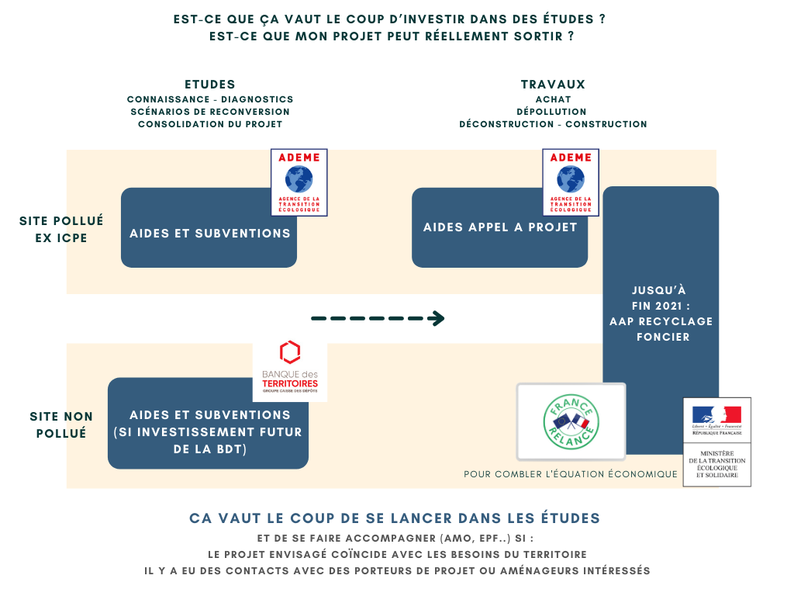

- Réaliser des études préalables est primordial avant de se lancer dans un projet d'aménagement ou d'acheter un foncier enfriché. Cela permet de **bien connaitre les enjeux actuels et futurs liés au terrain ou au projet**. Cela évite surtout certains écueils (bien connaître les besoins du territoire, l'état du marché, les risques de pollution, etc.) et aide par la suite à **envisager différents scénarios d'usage**, avec leur **faisabilité financière** et opportunité par rapport au contexte du territoire. Pour les sites pollués il existe des aides et subventions de l'[ADEME](https://betagouv.github.io/urbanvitaliz/TMP_resources/ademe_plan_gestion). A l'inverse, pour les sites qui ne le sont pas, la Banque des Territoires peut subventionner quelques études lorsqu'elle souhaite proposer ses services pour le financement de la réalisation du projet.

- Pour les phases de dépollution éventuelle, de deconstruction puis de construction et de tous travaux confondus, il est important de **consolider le projet envisagé** en amont avec un plan d'aménagement affiné et les **éléments de cadrage technique et financier**. De la même manière, pour les sites pollués, des aides et subventions diverses existes, notamment celles de l'ADEME. Pour les sites non pollué les différents appel à projet France Relance ou Fonds friche sont disponible jusqu'à fin 2021.

## 💡 Ressources en lien :

[Faire appel à un Assistant à Maitrise d'Ouvrage pour m'aider à faire avancer mon projet de A à Z](https://betagouv.github.io/urbanvitaliz/TMP_resources/AMO)
[Un peu d'aide pour la mise en place d'une mission d'Assistance à Maitrise d'Ouvrage](https://betagouv.github.io/urbanvitaliz/TMP_resources/CDC_AMO)
[Aides aux études pour la revitalisation des friches polluées via l'Ademe](https://betagouv.github.io/urbanvitaliz/TMP_resources/ademe_plan_gestion)

