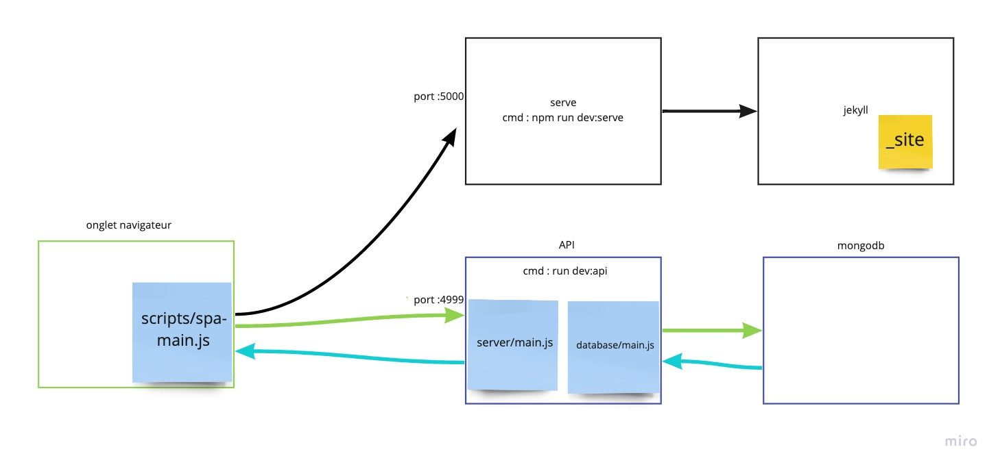
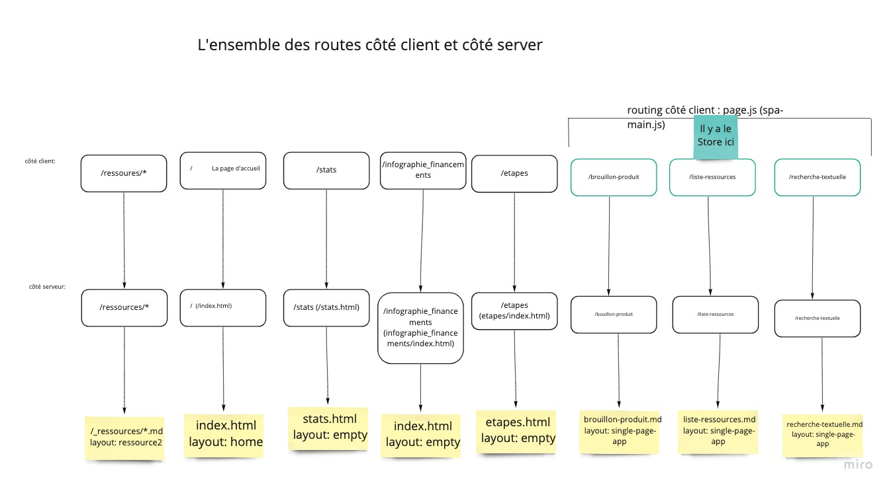

# Documentation techinque

(Avril 2021) 

Documentation de certains aspects techniques d'Urban Vitaliz

(source pour les schemas : https://miro.com/app/board/o9J_lU1mqi4=/)

## Architecture Technique



Ce diagamme décrit l'architecture dans un environnement de développement.

En production, l'hébergement Jekyll est géré par Github Pages.\
le serveur D'API est hébergé chez Clever Cloud.


### Listes des technos principales

- [Jekyll](https://jekyllrb.com/docs/)
    - Cela permet à des personnes non-dev de participer au site web en créant ou modifiant du markdown. 
- [Svelte](https://svelte.dev/docs) 
- [Rollup](https://rollupjs.org/guide/en/)
- [MongoDB](https://docs.mongodb.com/drivers/node/current/)
- [Express.Js](https://expressjs.com/fr/4x/api.html)
- [Baredux](https://github.com/DavidBruant/baredux)
- [Scss](https://sass-lang.com/documentation)
- [Lunr](https://lunrjs.com/docs/index.html)


## Expérience utilisateur des URLs

Les Urls de l'application sont déterminées par Jekyll.
Pour certaines routes, un routeur côté client ([page.js](https://visionmedia.github.io/page.js/)) prend le relais (Single page Application).

Les pages de la SPA utilisent [`layout: single-page-app`](../../_layouts/single-page-app.html)


### Liste des Routes et de qui gère quoi (Avril 2021)

 


## Récupération des ressources

Pour l'affichage, la recherche et le filtrage l'application à besoin de toutes les ressources.

Au début, nous utilisions l'APi Github pour les récupérer. 
Et maintenant nous utilisons [`allRessources.json`](../../allRessources.json)

Il s'agit d'un fichier Json que Jekyll va créer à partir de la [collection](https://jekyllrb.com/docs/collections/) `ressources`

Aujourd'hui (avril 2021 - ~30 ressoures), le fichier fait 220ko (30ko gzippé).

⚠️ Il arrive que parfois Jekyll ne re-build pas `allRessouces.json` en local (peut-être que c'est à cause de l'option `--incremental`).


## Modèle de sécurité 

La sécurité est basé sur les [capability URL](https://www.w3.org/TR/capability-urls/)

C'est à dire qu'il n'y a pas de mot de passe. La sécurité d'une action / d'une ressources est garantie par le fait qu'une URL est non-devinable.

Et c'est pour cela qu'il n'y a pas de cookie de session ni de cookie tout court, notamment.


### Login

Il n'a donc pas de mot de passe.
Dans l'idée une personne créé un "compte" à partir de son adresse email.

Elle reçoit un email avec une capability Url et cette Url lui donne accès à son "compte".
La sécurité de son "compte" dépend dû fait qu'elle garde cette capability Url secrete (comme le garderais un mot de passe secret).

Ensuite, A partir de cette Url on retrouve les éléments qui sont lier à cette personne (Bookmarks, ressources recommandées...)

Pour le MVP **nous n'avons pas implémenté l'envoie d'email**, donc toute personne saisissant la bonne adresse email aura accès au contenu de la collectivité correspondante.


### Envoi de recommandations

Afin que tout le monde ne puissent pas envoyer des recommandation, cette action devrait être accessible via une capability url, connue uniquement des membres de l'équipe Urban Vitaliz et non une Url facilement devinable comme actuellement. 


## Base de données

L'API stocke les données dans une base de données MongoDB

[migrate-mongo](https://www.npmjs.com/package/migrate-mongo) est utilisé pour les migrations


### Créer une migration

```sh
npm run database:migration:create -- <description>
```

### Mise à jour de la base de donnée

```sh
npm run database:migrate:up
```

(un de ces 4, ça sera caché dans un process de déploiement continu)

### Redescendre et status

```sh
npm run database:migrate:down
npm run database:migrate:status
```


